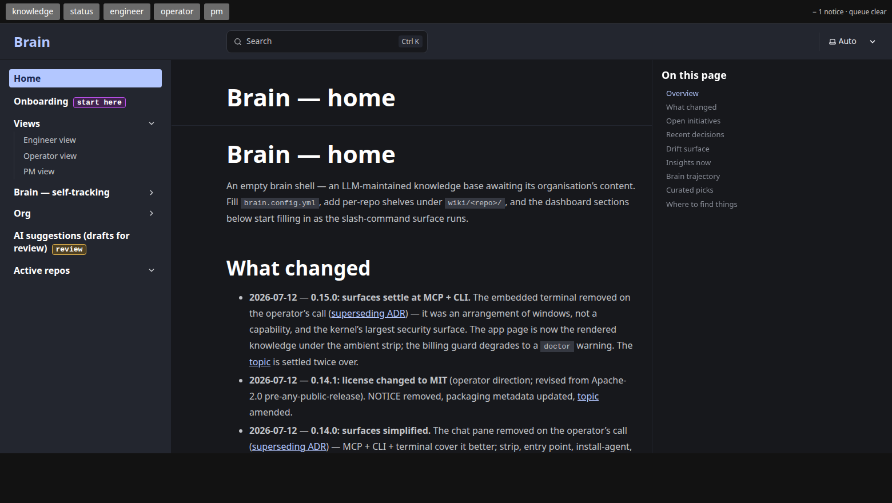

# brain

**A knowledge base your coding agent maintains for you.** Point it at
your repos, docs, and decisions; the agent keeps a synthesized,
browsable wiki of what's true, what was decided, and why — accurate
enough to regenerate the code from, surface cross-team overlaps, and
serve as any agent's working memory.



## How it works — three ideas

1. **Sources go in, immutable.** Repos, documents, conversations,
   connector pulls land under `sources/` and are never rewritten.
2. **The wiki is the synthesis.** The agent maintains `wiki/` —
   per-repo shelves, decisions, discussions, state — with every
   claim citing a source. Rendered as a searchable site.
3. **Your agent drives it; you just talk.** "What needs attention?"
   digests the queue. "Note this decision" lands it where the rules
   say. The rulebook is `AGENTS.md` — **you don't read it, your
   agent does.**

The pattern is [Karpathy's LLM-maintained
wiki](https://gist.github.com/karpathy/442a6bf555914893e9891c11519de94f);
this repo is that pattern productised: governance, health checks,
a queue that accumulates work while you're away (no scheduled LLM
runs, ever — see below), and one app to live in.

## Quickstart

```bash
git clone <this-repo> brain && cd brain
python3 tools/brain.py setup     # idempotent bootstrap: env, config, hooks, timer, UI
brain                            # opens the app
```

That's the whole surface. The app is the **rendered knowledge** —
live-reloading as the agent works, with an ambient strip showing
health and what's waiting. Your agent runs where it already lives:
`python3 tools/brain.py install-agent --all` wires the brain's MCP
server into Claude Code, Codex, Cursor, OpenCode, or any MCP-aware
client — put your terminal beside the app window and talk.

Two guarantees worth knowing on day one:

- **No scheduled LLM runs, ever.** A local timer runs cheap
  deterministic producers that *queue* work; your interactive
  session digests it ("tend the brain"). Nothing bills while you
  sleep.
- **Nothing runs a shell for you.** The kernel spawns no harness
  subprocesses and embeds no terminal — your sessions are your own,
  on your logged-in subscription. `doctor` warns if metered API
  keys sit in the environment you launch your harness from.

## Onboarding

Two built-in paths, both inside the app (`brain`, then the nav):

- **New to the brain?** Click **Onboarding** — a ~10-minute deck
  covering the three ideas, governance, the daily loop, and a
  step-by-step **first-session tutorial** (steps 1–6, from `setup`
  to your first tend). It lives at `localhost:8765/onboarding/`.
- **New to a project the brain tracks?** Open that project's shelf
  home (e.g. `/your-repo/`) — every shelf renders a generated
  **Project overview**: a start-here reading path (purpose →
  architecture → state → conventions), open work, recent
  decisions, and freshness. Gaps are stated honestly, with the
  command that fills them. Send a new teammate the shelf link; ten
  minutes of reading replaces the first week of asking around.

---

Everything below is reference — the machinery your agent operates so
you don't have to.

## What ships in the shell

The **kernel** — mechanism, no content:

- **`AGENTS.md`** — the schema/protocol the agent follows: three
  layers (sources → wiki → schema), three levels (brain / org /
  repo), page kinds, governance, the `/shape` workflow,
  `ai_suggestion` discipline.
- **`tools/`** — `brain.py` (validate / check / views / search /
  stats / status / schedule / sync-cursor / install-sibling / init),
  the stdio MCP server, sibling-repo sync, local hooks, page
  templates.
- **`.claude/`** — the full slash-command surface (`/in`, `/capture`,
  `/ask`, `/sync`, `/groom`, `/shape`, `/continue`, `/zoom-out`,
  `/rfc`, `/pr`, `/review`, `/spawn`, `/rebase`, …) as skills, plus
  the three agent personas (PM / Tech Lead / Developer) that drive
  Shape Up.
- **`ui/`** — the purpose-built Astro app: the briefing (opinionated
  home), lifecycle-aware page rendering, Pagefind search, and an
  onboarding deck at `/onboarding/`.
- **`.github/workflows/`** — the validate gates and the daily
  scheduled-operations runner.
- **`tests/`** — kernel invariants (shape-only; no content coupling).

The **content** is yours: `wiki/` starts as an empty three-level
skeleton, `sources/` starts empty, `log/log.md` starts empty.

## Adopting the shell for a project

This repository is the tool's own project — real adoptions get their
own **instance**:

```bash
python3 tools/brain.py init ~/projects/my-brain --full --org "My Org"
cd ~/projects/my-brain && python3 tools/brain.py setup
```

`init --full` births a complete instance from the kernel manifest —
the whole mechanism plus the kernel's decision trail, none of this
repo's self-tracking content — git-initialised and gate-passing.
Then, inside the instance:

```bash
python3 tools/brain.py setup     # one command: .env, org, repos, hook, timer, UI deps
```

The wizard is idempotent — it prompts for the organisation name and
active repos (or takes `--org` / `--repos` / `--yes`), copies
`.env.example` to `.env` (local-first mode), installs the pre-commit
gate and the daily accumulation timer, and ends with the `doctor`
health checklist. `brain doctor` re-checks any time;
`brain dash` opens the local ops dashboard (health, tend queue,
quick start) at `localhost:8765/dash`.

Then:

1. **Author personas.** `.claude/personas/team/` (internal
   archetypes) and `users/` (customer archetypes) are authored
   per-organisation — see `.claude/personas/README.md`. The
   `agents/` roles ship with the kernel.
2. **Ingest.** Point the agent at a repo or document: `/in <source>`.
   Shelves grow under `wiki/<repo>/` as content earns them. From
   then on the loop is hands-off: the timer queues work, the
   session-start line tells you when there's something to digest,
   and `/tend` (or `brain tend` from any shell) digests it.
3. **Wire the reach surface** (optional). Register the MCP server,
   symlink `tools/brain` onto your PATH, run
   `brain.py install-sibling <repo>` to surface brain pages inside
   sibling-repo agent sessions.

## Repo layout

```
AGENTS.md           # schema / protocol the agent follows (CLAUDE.md → AGENTS.md)
brain.config.yml    # per-organisation config: org name, repo registry
.claude/            # slash commands, skills, settings, personas
sources/            # raw, immutable inputs (additive only)
wiki/               # synthesis layer — per-repo + org + brain-meta
log/                # append-only operations log (log.md)
tools/              # brain.py CLI, sync-siblings, hooks, templates
ui/                 # purpose-built Astro app (briefing + corpus + search) — src/content/docs symlinks ../wiki
tests/              # kernel invariant tests (pytest)
```

## Configuration

### Local Python venv (recommended)

`tools/preflight.sh` and the PreToolUse hook in
`.claude/settings.json` look for python3 at
`~/.local/share/mempalace-venv/bin/python3` and fall back to
system python3 when missing. The fallback works for `validate`
+ `check`, but `brain.py views` needs **tiktoken** to compute
the same per-page token counts as CI — without it `pages.json`
drifts and the views-up-to-date gate rejects the push.

Create the venv once with:

```bash
tools/setup-local.sh
```

### Machine-local term denylist (optional)

For public or shared brains (this repo included), keep terms that must never ship —
client names, internal repo names — in `.reflection-denylist`
(git-ignored, one term per line). `brain.py reflection-check
denylist` flags any tracked file containing them; the terms
themselves never enter the repo. An absent file is a clean no-op.

### Sibling-repo root

All tooling resolves sibling-repo paths through one configurable
root: the `BRAIN_PROJECTS_ROOT` environment variable, defaulting to
`~/projects/`. Set it in your shell profile if your repos live
elsewhere:

```bash
export BRAIN_PROJECTS_ROOT="$HOME/work"
```

## Everyday commands

```bash
python3 tools/brain.py validate     # frontmatter + section conformance
python3 tools/brain.py check        # source citations resolve
python3 tools/brain.py stats        # corpus shape
python3 tools/brain.py views        # regen wiki/_views/ (by-kind/team/repo, pages.json, ai-suggestions, custom role views as reader-facing briefs)
python3 tools/brain.py search '<q>' # hybrid keyword search
python3 tools/brain.py status       # single-pane health dashboard
python3 tools/brain.py inbox summary # the tend queue in one line
python3 tools/brain.py inbox ack <id> # reviewed, no change — suppress a recurring item until the page changes
python3 tools/brain.py inbox pending-grades # judged attention items awaiting a grade
python3 tools/brain.py links        # link-graph health (orphans / hubs / suggestions)
python3 tools/brain.py index --schema # the derived-index schema (for view specs)
python3 tools/brain.py query '<sql>' # read-only SQL over the index
python3 tools/brain.py setup        # one-command bootstrap (idempotent)
python3 tools/brain.py doctor       # health checklist (operating mode, timer, hooks)
python3 tools/brain.py check-no-personal-data  # reject session URLs/personal data in a commit msg or PR body (stdin/--file)
tools/brain dash                    # local ops dashboard (serve + open /dash)
python3 tools/brain.py install-agent --all  # wire claude/cursor/codex/opencode to the MCP
tools/brain tend                    # open the agent with /tend
tools/install-timer.sh              # daily accumulation timer (systemd user / cron)
pytest tests/                       # kernel invariants
```

### Pre-commit hook

```bash
ln -s ../../tools/git-hooks/pre-commit .git/hooks/pre-commit
```

Gates: `brain.py validate` + auto-stages `wiki/_views/` regen +
`brain.py reflection-check links`.

## Workflow — slash commands

| Command                      | What it does                                                                                       |
|------------------------------|----------------------------------------------------------------------------------------------------|
| `/in <source>`               | Add something to the brain. Auto-routes; hands off to `/shape` when it spots a pitch or pre-existing decision. |
| `/capture <scope>`           | Capture in-flight signal (conversation, design discussion) without a source URL.                  |
| `/ask <question>`            | Query. Default factual lookup; escalates to plan / overlap / coverage by phrasing.                |
| `/sync`                      | Mechanical health sweep: sibling-repo fetch, lint, source-link check, schema validate, regen views. |
| `/tend [<budget>]`           | Digest the inbox — pending synthesis work queued by the deterministic producers. Budget = count / time-box / kind / id. |
| `/groom`                     | Judgement sweep: confidence demotion, insight decay, supersede→archive transitions.                |
| `/shape <scope> <pitch>`     | **The only path to ADRs/PRDs.** Manual by default — pauses at every load-bearing decision. `--auto`, `--pitch`, `--record`, `--epic`, `--rfc` modes. |
| `/continue <slug-or-PR#>`    | Resume in-flight `/shape` work; detects phase from artifact state.                                |
| `/zoom-out <target>`         | Per-work-item zoom-out brief — big-picture fit during deep focus.                                 |
| `/rfc <page>`                | Standalone RFC pass — append a multi-perspective section to a wiki page.                          |
| `/promote <insight>`         | Graduate `kind: insight` → `kind: initiative`.                                                    |
| `/pr <summary>`              | Open a PR for current changes; runs preflight, watches CI, chains to `/review` on green.          |
| `/review <PR#>`              | Review and auto-merge after every guardrail passes.                                               |
| `/spawn <slug> [--target …]` | Opt-in parallel-effort spawn: worktrees + branches + effort registry + background owner subagent. |
| `/list-efforts [<status>]`   | Read-only surface for in-flight parallel efforts.                                                 |
| `/rebase`                    | Cheap-rebase onto `origin/main`, auto-resolving `wiki/_views/` conflicts via regen.               |

Full protocols live in `.claude/skills/<skill>/SKILL.md`; governance
rules in `AGENTS.md` § Governance. PR descriptions are plain-English
executive summaries (see `.github/pull_request_template.md`) — no
personal data, no boilerplate.

## External integrations

| System            | State                | Notes                                                          |
|-------------------|----------------------|----------------------------------------------------------------|
| Datadog / Langfuse | ✅ pull connectors | Monitor+SLO state / prompt inventory → snapshots + state extracts for view tiles. |
| GitHub / Notion / Slack | ✅ pull connectors | Snapshot-writers: immutable files into `sources/`, inbox items out. Configure `connectors:` in `brain.config.yml` + read-only tokens in `.env`. |
| Structure           | ✅ pull connector  | Deterministic code-shape snapshots (source inventory + Python symbols) → architectural-drift inbox items via baseline diff; drift auto-clears once a wiki page cites the snapshot. No network / binary / LLM; read-only git with a clean-tree guard. Configure `connectors.structure.repos`. |
| GitHub            | via `gh` CLI         | Pre-allowed in `.claude/settings.json`.                        |
| MCP               | ✅ `tools/brain-mcp.py` | Read-only; stdio or `--http` (loopback Host + Origin checks); `BRAIN_SERVING=1` excludes ai-suggestion drafts across *every* read surface (MCP, serve JSON API, search CLI, static build) + query audit log. |
| Datasette         | ✅ pilot             | `tools/serve-datasette.sh` — faceted browse + SQL + JSON API over the derived index (immutable mode). |
| mempalace         | optional             | Verbatim / semantic-recall layer.                              |

## Deploy

One infra-agnostic image (`deploy/`): `BRAIN_SURFACE` selects the
public surface (ui / mcp / datasette) on the platform's `$PORT`.
Railway: root `railway.toml` points at it. Local emulation beside a
development brain: `docker compose -f deploy/docker-compose.yml up`
(ports 9080–9082). Multiple brains per machine: `BRAIN_PORT` /
`BRAIN_MCP_PORT` + per-instance timer units. See `deploy/README.md`.

## Browse (UI)

```bash
cd ui && npm install                # first run only
npm run build                       # production build
npm run dev                         # local dev server
```

`ui/src/content/docs` symlinks to `../wiki`. The app's root is the
**briefing** — the brain's judgement of what needs you, what's in
flight, and what's on the table — and every wiki page renders inside
the app with lifecycle chrome (kind/status/confidence chips,
executive summary, AI-draft and superseded banners). `/graph/`
renders the link graph with per-edge provenance — solid for authored
edges, dashed-faint for machine-suggested ones, a ⚑ mark on
low-confidence pages the graph leans on. Pagefind search at
`/search/`. Local-first — share via repo paths, not a hosted URL.
